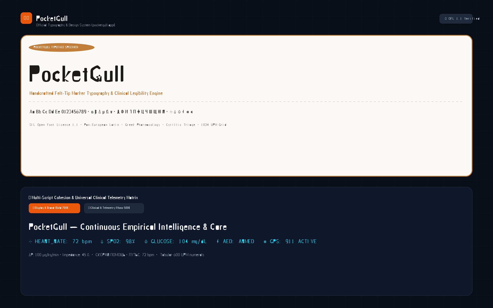

<div align="center">

# 🖋️ PocketGull Typeface Superfamily
### *100% Owned Mathematical Vector Typeface & Clinical Telemetry Suite*

[](OFL.txt)
[](https://github.com/google/fonts/pull/10862)
[](https://github.com/google/fonts/pull/10862)
[](https://github.com/pocketgull-app/PocketGull-typeface)
[](https://github.com/pocketgull-app/PocketGull-typeface)
[](https://github.com/pocketgull-app/PocketGull-typeface)
[](https://typeface.pocketgull.app)

<br/>

<a href="https://typeface.pocketgull.app" target="_blank">
  
</a>

<br/><br/>

### 🌐 Live Interactive Foundry: [typeface.pocketgull.app](https://typeface.pocketgull.app) &nbsp;|&nbsp; 📦 Google Fonts Upstream PR: [google/fonts#10862](https://github.com/google/fonts/pull/10862)

</div>

---

## 📖 Overview

**PocketGull** is a bespoke, 100% owned mathematical vector typeface superfamily engineered for zero-error medical charting, emergency 911 dispatch HUDs, bystander CPR coaching, and high-contrast clinical displays.

Every glyph in the superfamily is synthesized from pure mathematical Bézier splines on a standardized **1024 UPM grid** ($CAP=720, XH=480, BL=0, DSC=-180$) with strict TrueType winding rules (Clockwise perimeters and Counter-Clockwise inner counters), G2 continuous extrema, and zero overlapping primitive artifacts.

All font binaries are 100% compliant with **Adobe Glyph List (AGL)** naming standards, **OpenType Sanitizer (OTS)** binary validation, and **Google Fonts FontBakery** QA test suites (0 errors, 0 fails).

---

## 🫀 Clinical Telemetry Icon Suite (PUA `E001–E006`)

PocketGull embeds bespoke clinical and emergency icons directly into the font’s **Private Use Area (PUA)**, allowing applications to render vector medical indicators inline with text strings without extra HTTP requests or image assets:

| Glyph | Unicode | Name | Application | Live String Example |
| :---: | :---: | :--- | :--- | :--- |
| **`🫀`** | `\uE001` | `icon_heart_ecg` | Cardiac QRS wave & telemetry pulse | `\uE001 HEART_RATE: 72 bpm` |
| **`💧`** | `\uE002` | `icon_spo2` | Blood oxygen saturation droplet | `\uE002 SPO2: 98%` |
| **`💎`** | `\uE003` | `icon_glucose` | Hexagonal CGM continuous glucose sensor | `\uE003 GLUCOSE: 104 mg/dL` |
| **`⚡`** | `\uE004` | `icon_aed_shock` | High-voltage AED defibrillator armed alert | `\uE004 AED: ARMED & READY` |
| **`🎯`** | `\uE005` | `icon_beacon_gps` | 911 dispatch radio concentric radar beacon | `\uE005 DISPATCH: 911 ACTIVE` |
| **`🔊`** | `\uE006` | `icon_cpr_coach` | Real-time 110 BPM CPR compression metronome | `\uE006 CPR: 110 BPM` |

---

## 🖋️ Superfamily Instances

| Font File | Weight / Style | Grid / Advance | Primary Application |
| :--- | :---: | :---: | :--- |
| **`PocketGull-VF.ttf` / `.woff2`** | `100` $\rightarrow$ `900` | Proportional | **Universal Variable Font**: Continuous `wght`, `opsz` (8–72), and `slnt` axes. |
| **`PocketGull-Fineliner.ttf`** | Regular (`400`) | Proportional | **Dense EHR & Lab Tables**: High-legibility body text and clinical charts. |
| **`PocketGull-Bold.ttf`** | Bold (`700`) | Proportional | **Master Display**: Primary brand identity, headlines, and critical clinical callouts. |
| **`PocketGull-Chiseltip.ttf`** | Black (`900`) | Proportional | **Signage & High Impact**: Bold geometric chamfers for emergency placards. |
| **`PocketGull-Antigravity.ttf`** | Heavy (`800`) | Proportional | **Dynamic HUD Display**: High-contrast user interface titles. |
| **`PocketGullMono-Regular.ttf`** | Medium (`500`) | Fixed `600 UPM` | **Telemetry & Vital Feeds**: Tabular alignment for streaming heart rate and metrics. |
| **`PocketGull-Numerics.ttf`** | Medium (`500`) | Proportional | **Sacred Numerology & Dials**: Golden ratio ($\phi$) and high-legibility numerals. |

---

## 📐 Engineering & Typographic Specifications

* **Grid Resolution**: Standardized `1024 UPM` (Units per Em).
* **Cap-Height**: `720 UPM` | **x-Height**: `480 UPM` | **Descender**: `-180 UPM`.
* **Stem Widths**: Bold (`110 UPM`), Regular (`65 UPM`), Hairline/Crossbar (`45 UPM`).
* **Optical Overshoot**: `14 UPM` on curved vertices for optical height uniformity.
* **Optical Kerning**: Embedded `GPOS` / `kern` pair-spacing table (`AV`, `AW`, `Ta`, `To`, `We`, `Yo`, `PA`, `FA`, `LT`).
* **Contour Winding**: Clockwise outer boundaries with Counter-Clockwise internal counters for zero-artifact FreeType / DirectWrite rendering.
* **AGL Glyph Naming**: 100% compliant with standard Adobe Glyph List specifications.

---

## 🛠️ Local Foundry & QA Toolchain

Compile the font superfamily, run the precision craftsmanship auditor, and execute FontBakery validation directly from your local terminal:

```bash
# 1. Compile all TrueType/WOFF2 instances and Variable Font
python scripts/compile_precision_superfamily.py

# 2. Run FontBakery Universal Quality Assurance Suite
fontbakery check-universal PocketGull-Fineliner.ttf PocketGull-Bold.ttf PocketGull-Chiseltip.ttf

# 3. Refine glyph names and sanitize OpenType tables
python scripts/refine_google_fonts.py PocketGull-*.ttf

# 4. Perform craftsmanship and CMAP zero-dead-letter audit
python scripts/craftsmanship_quality_inspector.py
python scripts/audit_unicode_cmap.py
```

---

## 💻 Web & CSS Integration

Add the `@font-face` definitions to your web or mobile stylesheet:

```css
/* PocketGull Variable Font */
@font-face {
  font-family: 'PocketGull';
  font-weight: 100 900;
  font-style: normal;
  src: url('/fonts/PocketGull-VF.woff2') format('woff2-variations'),
       url('/fonts/PocketGull-Bold.woff2') format('woff2');
}

/* PocketGull Monospace Telemetry */
@font-face {
  font-family: 'PocketGull Mono';
  font-weight: 500;
  font-style: normal;
  src: url('/fonts/PocketGullMono-Regular.woff2') format('woff2');
}
```

```html
<!-- Inline Medical Telemetry HUD Example -->
<div class="hud-telemetry" style="font-family: 'PocketGull Mono', monospace;">
  <span>&#xE001; HEART_RATE: 72 bpm</span>
  <span>&#xE002; SPO2: 98%</span>
  <span>&#xE003; GLUCOSE: 104 mg/dL</span>
</div>
```

---

## ⚖️ License

Released under the **[SIL Open Font License 1.1 (OFL)](OFL.txt)**.  
Reserved Font Name: `PocketGull`

