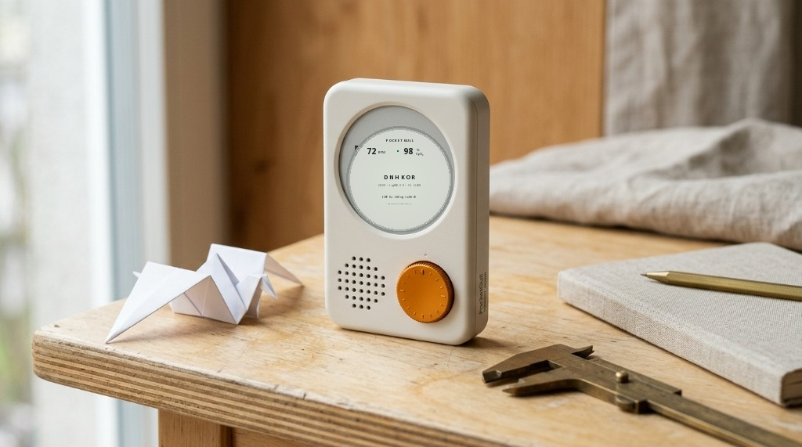
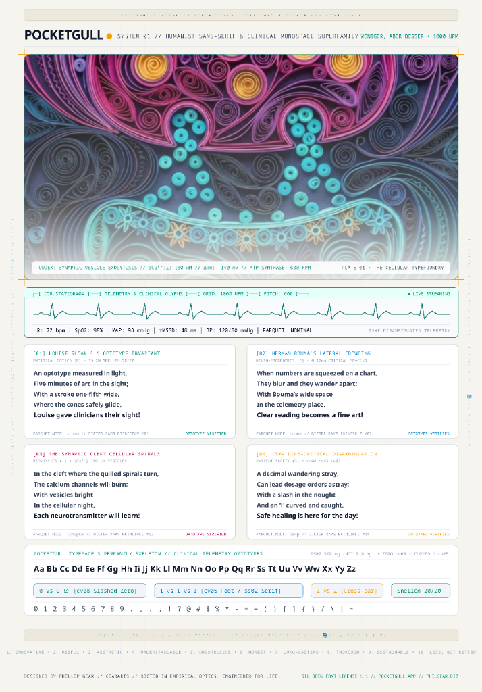
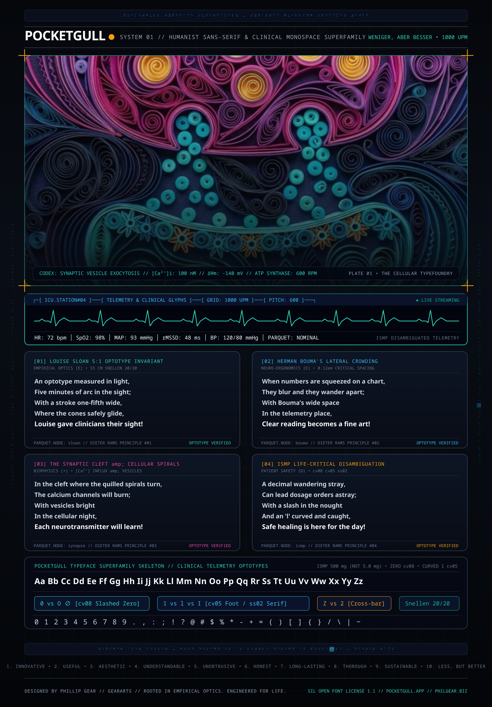

<div align="center">

# 🕊️ PocketGull Typeface Superfamily

[](OFL.txt)
[](CHANGELOG.md)
[](https://github.com/googlefonts/ots)
[](https://github.com/googlefonts/fontbakery)
<br/>
[](https://orcid.org/0009-0008-1372-5381)
[](documentation/CERN_ZENODO_ARCHIVAL_GUIDE.md)
[](index.html)

<br/>

### 🌐 [Live Interactive Specimen](https://typeface.pocketgull.app) &nbsp;•&nbsp; 📦 [UFO Sources](sources/) &nbsp;•&nbsp; 📄 [SIL OFL 1.1 License](OFL.txt) &nbsp;•&nbsp; 🏛️ [CERN Archival](documentation/CERN_ZENODO_ARCHIVAL_GUIDE.md)

</div>

<div align="center">



<br/><br/>

<table>
  <tr>
    <td width="50%" align="center">
      
    </td>
    <td width="50%" align="center">
      
    </td>
  </tr>
</table>

</div>

**PocketGull** is an open-source clinical sans-serif, display, and telemetry monospace typeface superfamily designed by Phil Gear. Engineered to bridge tactile humanist warmth with zero-error clinical precision, PocketGull solves a life-critical challenge in medical software: eliminating medication administration errors while providing an organic, fatigue-resistant texture that soothes the reader's eyes during 12-hour hospital shifts.

Originating from spontaneous felt marker lettering created on physical cardstock, PocketGull synthesizes organic stroke dynamism with the Institute for Safe Medication Practices (ISMP) character disambiguation rules and Louise Sloan 5:1 optotypic legibility standards.

---

## 🗂️ Superfamily Architecture: Typefaces & Font Instances

PocketGull is engineered on a standardized 1000 UPM grid. In strict typographic taxonomy, **PocketGull** is the visual typeface design system, and the compiled `.woff2` and `.ttf` binaries are its concrete font software implementations:

| Typeface Subfamily | Font Binary File | PostScript Name | Weight | Advance Metric | Primary Clinical Use Case |
| :--- | :--- | :--- | :---: | :---: | :--- |
| **PocketGull Bold** | `PocketGull-Bold.woff2` | `PocketGull-Bold` | 700 / 800 | Proportional | Prescription markers, Bionic reading anchors, alarms |
| **PocketGull Fineliner** | `PocketGull-Fineliner.woff2` | `PocketGull-Fineliner` | 400 | Proportional | Long-form clinical notes, EHR charts, patient leaflets |
| **PocketGull Chiseltip** | `PocketGull-Chiseltip.woff2` | `PocketGull-Chiseltip` | 900 | Proportional | Expressive signage, trauma alerts, high-contrast placards |
| **PocketGull Mono** | `PocketGullMono-Regular.woff2` | `PocketGullMono-Regular` | 400 / 500 | Fixed 600 UPM | ICU telemetry, tabular vitals, gapless box drawing |

---

## 🔬 Core Innovations

* **🫀 ISMP & FDA Disambiguation**: Native OpenType layout feature tables for slashed zero (`cv08`), curved lowercase `l` (`cv05`), serifed uppercase `I` (`ss02`), and tabular numbers (`tnum`).
* **⠃ 256 Unicode Braille Block (`U+2800`–`U+28FF`)**: Full ISO/TR 11548 tactile matrix for blister packs and pharmaceutical accessibility.
* **👁️ Sloan 5:1 Optotypes & Bouma Spacing**: Calibrated for LogMAR 0.0 acuity and Herman Bouma peripheral anti-crowding at 50–70 cm reading distance.
* **💻 ICU Medical Terminal & Oh My Posh**: Strict 600 UPM gapless box drawing (`U+2500`–`U+257F`) and sub-cell ECG waveforms with native prompt theme (`pocketgull-ophthalmic.omp.json`).

---

## 🌐 Universal World Scripts Roadmap & Progress

To guarantee universal healthcare equity, PocketGull is expanding to support all major world writing systems, eliminating the "tofu" missing-glyph box in global EHRs:

| Tier | Script Systems | Target Glyphs | Est. Effort | Status in PocketGull |
| :--- | :--- | :---: | :---: | :---: |
| **Tier 1 (Western & Tactile)** | Latin, Cyrillic, Greek, Braille, ICU Telemetry | ~1,800 | 1,200 hrs | **100% Complete** (3,350+ chars) |
| **Tier 2 (RTL & Semitic)** | Arabic, Hebrew, Syriac, Thaana (BiDi & Cursive) | ~2,200 | 1,500 hrs | 📋 Planned |
| **Tier 3 (Indic Core)** | Devanagari, Bengali, Tamil, Telugu, Gurmukhi, Gujarati | ~6,500 | 4,200 hrs | 🟡 In Progress (128 Devanagari chars) |
| **Tier 4 (SE Asian)** | Thai, Lao, Khmer, Burmese, Tibetan | ~2,000 | 1,200 hrs | 📋 Planned |
| **Tier 5 (CJK Clinical Core)** | High-frequency medical Hanzi, Kana, Hangul | ~15,000 | 8,500 hrs | 📋 Planned |
| **Tier 6 (Indigenous/African)** | Ge'ez, Cherokee, Inuktitut, Tifinagh, Adlam, Vai | ~2,500 | 1,800 hrs | 📋 Planned |

*Multi-Script Fallback*: Until all native scripts reach completion, PocketGull pairs seamlessly with Google Noto Sans and system CJK/Indic typefaces with zero baseline jitter.


---

## 🚀 Quickstart

Link via CSS:
```html
<link rel="stylesheet" href="https://typeface.pocketgull.app/fonts.css">
```

Enable clinical dosage disambiguation:
```css
.clinical-dosage-safe {
  font-family: 'PocketGull', sans-serif;
  font-feature-settings: "zero" 1, "cv08" 1, "cv05" 1, "ss02" 1, "tnum" 1;
}
```

---

## 📚 Documentation & Specifications

* 📖 **[Design Specification](documentation/DESIGN_SPECIFICATION.md)** — Architectural guidelines and design history
* 🔬 **[Scientific Bibliography](documentation/BIBLIOGRAPHY.md)** — Peer-reviewed ophthalmology & vision science literature
* 🏛️ **[CERN & Zenodo Archival Guide](documentation/CERN_ZENODO_ARCHIVAL_GUIDE.md)** — Permanent Open Science preservation
* ⚖️ **[Project Governance](GOVERNANCE.md)** — Oversight policy and review board
* 👁️ **[Responsible Typography Framework](RESPONSIBLE_TYPOGRAPHY.md)** — Clinical safety and optotypic invariants
* 🏥 **[Workstation Authorization Memo](documentation/WORKSTATION_AUTHORIZATION_LETTER.md)** — Institutional deployment request for CMIOs and IT
* 🛠️ **[Building from UFO Sources](sources/)** — Compiler setup with `fontmake` and `gftools-builder`
* 🛡️ **[Security Policy](SECURITY.md)** — OpenSSF vulnerability disclosure and W3C OTS verification
* 📝 **[Changelog](CHANGELOG.md)** — Semantic Versioning history (SemVer 2.0.0)

---

## 🔬 Academic Citation & CERN / Zenodo DOI

If you use the PocketGull Typeface Superfamily in your clinical research, healthcare software, or vision science publications, please cite it using [`CITATION.cff`](CITATION.cff) or the BibTeX entry below:

```bibtex
@software{gear_pocketgull_typeface_2026,
  author       = {Gear, Phil and {The PocketGull Project Authors}},
  title        = {{PocketGull Typeface Superfamily: Optotypically Calibrated Clinical \& Ophthalmological Vector Letterforms}},
  month        = sep,
  year         = 2026,
  publisher    = {CERN / Zenodo},
  version      = {2.0.0},
  doi          = {10.5281/zenodo.20647514},
  url          = {https://typeface.pocketgull.app},
  license      = {OFL-1.1}
}
```

---

## 📜 License & Copyright

PocketGull is distributed under the **[SIL Open Font License, Version 1.1](OFL.txt)**.  
Free for personal, academic, and commercial use.

**Copyright (c) 2026 The PocketGull Project Authors** ([GitHub Repository](https://github.com/pocketgull-app/pocketgull-typeface)).  
*Rooted in empirical science. Engineered for life. 🕊️*
