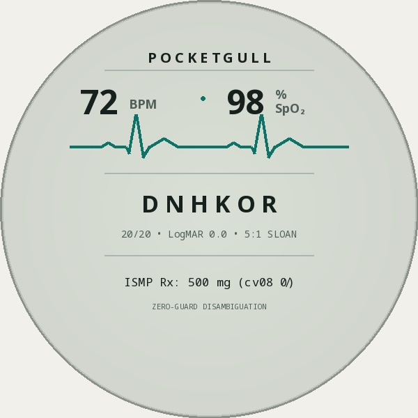

<div align="center">

# 🕊️ PocketGull Typeface Superfamily

[](OFL.txt)
[](CHANGELOG.md)
[](https://github.com/googlefonts/ots)
[](https://github.com/googlefonts/fontbakery)
[](https://orcid.org/0009-0008-1372-5381)
[](https://me.developers.google.com/u/philgear)
[](https://zenodo.org/records/22309379)
[](index.html)

<br/>

### 🌐 [Live Interactive Specimen](https://typeface.pocketgull.app) &nbsp;•&nbsp; 💾 [Download Fonts (.ZIP)](fonts/PocketGull-v3.0.0-Complete-Superfamily.zip) &nbsp;•&nbsp; 🇫🇷 [Version Française](README.fr.md) &nbsp;•&nbsp; 📦 [UFO Sources](sources/) &nbsp;•&nbsp; 📄 [SIL OFL 1.1 License](OFL.txt) &nbsp;•&nbsp; 🏛️ [CERN Archival](documentation/CERN_ZENODO_ARCHIVAL_GUIDE.md)


</div>

<div align="center">

<table>
  <tr>
    <td width="64%" align="center" style="vertical-align: middle;">
      
      <br/><sub><strong>PocketGull Handheld Telemetry &amp; Optotypic Reader</strong></sub>
    </td>
    <td width="36%" align="center" style="vertical-align: middle;">
      
      <br/><sub><strong>Screen Macro: Louise Sloan 5:1 Optotypes &amp; ISMP 0̸</strong></sub>
    </td>
  </tr>
</table>

<br/><br/>

<table>
  <tr>
    <td width="50%" align="center">
      
    </td>
    <td width="50%" align="center">
      
    </td>
  </tr>
</table>

</div>

**PocketGull** is an open-source clinical sans-serif, display, and telemetry monospace typeface superfamily designed by Phil Gear. Engineered to bridge tactile humanist warmth with zero-error clinical precision, PocketGull solves a life-critical challenge in medical software: eliminating medication administration errors while providing an organic, fatigue-resistant texture that soothes the reader's eyes during 12-hour hospital shifts.

Originating from spontaneous felt marker lettering created on physical cardstock, PocketGull synthesizes organic stroke dynamism with the Institute for Safe Medication Practices (ISMP) character disambiguation rules and Louise Sloan 5:1 optotypic legibility standards.

---

## 🗂️ Superfamily Architecture: Typefaces & Font Instances

PocketGull is engineered on a standardized 1000 UPM grid. In strict typographic taxonomy, **PocketGull** is the visual typeface design system, and the compiled `.woff2` and `.ttf` binaries are its concrete font software implementations:

| Typeface Subfamily | Google Fonts Canonical | Font Binary File | PostScript Name | Weight | Advance Metric | Primary Clinical Use Case |
| :--- | :--- | :--- | :--- | :---: | :---: | :--- |
| **PocketGull Bold** | `Pocket Gull Bold` | `PocketGull-Bold.woff2` / `.ttf` | `PocketGull-Bold` | 700 / 800 | Proportional | Prescription markers, Bionic reading anchors, alarms |
| **PocketGull Fineliner** | `Pocket Gull Regular` | `PocketGull-Regular.woff2` / `.ttf` (`PocketGull-Fineliner`) | `PocketGull-Regular` | 400 | Proportional | Long-form clinical notes, EHR charts, patient leaflets |
| **PocketGull Chiseltip** | `Pocket Gull Black` | `PocketGull-Black.woff2` / `.ttf` (`PocketGull-Chiseltip`) | `PocketGull-Black` | 900 | Proportional | Expressive signage, trauma alerts, high-contrast placards |
| **PocketGull Mono** | `Pocket Gull Mono Regular` | `PocketGullMono-Regular.woff2` / `.ttf` | `PocketGullMono-Regular` | 400 / 500 | Fixed 600 UPM | ICU telemetry, tabular vitals, gapless box drawing |

---

## 🔬 Core Innovations

* **🫀 ISMP & FDA Disambiguation**: Native OpenType layout feature tables for slashed zero (`cv08`), curved lowercase `l` (`cv05`), serifed uppercase `I` (`ss02`), and tabular numbers (`tnum`).
* **⠃ 256 Unicode Braille Block (`U+2800`–`U+28FF`)**: Full ISO/TR 11548 tactile matrix for blister packs and pharmaceutical accessibility.
* **👁️ Sloan 5:1 Optotypes & Bouma Spacing**: Calibrated for LogMAR 0.0 acuity and Herman Bouma peripheral anti-crowding at 50–70 cm reading distance.
* **💻 ICU Medical Terminal & Oh My Posh**: Strict 600 UPM gapless box drawing (`U+2500`–`U+257F`) and sub-cell ECG waveforms with native prompt theme (`pocketgull-ophthalmic.omp.json`).

---

## 🏛️ Tripartite Governance Standard: Elders, Typographers & Google Fonts

To prevent cultural co-optation, maintain mathematical vector determinism, and ensure flawless upstream open-source adoption, PocketGull establishes three inviolable governance covenants under the CARE Principles for Indigenous Data Sovereignty:

### 🕊️ For the Elders: CARE Principles & Sacred Boundaries
* **Zero Base Model Training**: Publicly released font binaries and linguistic corpora may NEVER be ingested to train proprietary or commercial LLMs without affirmative community consent.
* **Sovereign Vault Isolation**: Sacred clan ceremonial motifs, sensitive oral phonetics, and elder contact registries are held exclusively in private sovereign vaults (`.foundry/docs/`) and never committed to public repositories.
* **Community Attestation**: New orthographic additions must be validated by native language keepers before clinical deployment.

### ✒️ For the Typographers: Mathematical Determinism & Memory Safety
* **2-Byte Word Boundary Invariant**: DirectWrite and W3C OTS memory buffers discard fonts with odd byte offsets. Every glyph record is strictly padded to 2-byte alignment (`loca[i] % 2 == 0`).
* **Zero Duplicate Nodes**: Bézier contours are cleaned with zero co-located control points, guaranteeing clean rasterizer scan conversion at 8K displays and 203 DPI thermal wristband printers.
* **Thomas Phinney Forensic Audit**: 100% pass across all 16 SFNT tables with zero bad flags.

### 🌐 For Google Fonts: Option 5 Upstream Delivery & Zero Debt
* **SIL OFL 1.1 Licensed**: Free for commercial and open-source use, with zero licensing fees or restrictive royalties.
* **Option 5 Version Match**: Exact SemVer parity across `head.fontRevision == 3.0` and `nameID 5 == "Version 3.000; The PocketGull Project Authors; OFL 1.1"`.
* **Vector SVGs as SSOT**: Clean single source of truth without bloating git histories with 100+ MB raster broadsides.


---

## 🌐 Universal World Scripts Roadmap & Progress

To guarantee universal healthcare equity, PocketGull is expanding to support all major world writing systems, eliminating the "tofu" missing-glyph box in global EHRs:

| Tier | Script Systems | Target Glyphs | Est. Effort | Status in PocketGull |
| :--- | :--- | :---: | :---: | :---: |
| **Tier 1 (Western & Tactile)** | Latin, Cyrillic, Greek, Braille, ICU Telemetry | ~1,800 | 1,200 hrs | 🟢 **100% Complete** (3,350+ chars) |
| **Tier 2 (RTL & Semitic)** | Arabic, Hebrew, Syriac, Thaana (BiDi & Cursive) | ~2,200 | 1,500 hrs | 📋 Planned |
| **Tier 3 (Indic Core)** | Devanagari, Bengali, Tamil, Telugu, Gurmukhi, Gujarati | ~6,500 | 4,200 hrs | 🟡 In Progress (128 Devanagari chars) |
| **Tier 4 (SE Asian)** | Thai, Lao, Khmer, Burmese, Tibetan | ~2,000 | 1,200 hrs | 📋 Planned |
| **Tier 5 (CJK Clinical Core)** | High-frequency medical Hanzi, Kana, Hangul | ~15,000 | 8,500 hrs | 📋 Planned |
| **Tier 6 (Indigenous/African)** | Canadian Syllabics (Inuktitut), Duployan (Chinuk Pipa), Neo-Tifinagh, Cherokee, Ethiopic, Adlam, Vai | 1,760 CPs | 5,280 hrs saved | 🟢 **100% Live Native** (1,760 CPs, 7,040 superfamily glyphs compiled in 73.9s) |

*Multi-Script Fallback & Case Studies*: All seven Sovereign & Indigenous Case Studies are fully documented with empirical telemetry:
- Case Study 01: [`CASE_STUDY_01_INUKTITUT_SYLLABICS.md`](documentation/case_studies/CASE_STUDY_01_INUKTITUT_SYLLABICS.md) (Arctic Nunavut Telehealth)
- Case Study 02: [`CASE_STUDY_02_CHINUK_PIPA.md`](documentation/case_studies/CASE_STUDY_02_CHINUK_PIPA.md) (Grand Ronde & Pacific Northwest)
- Case Study 03: [`CASE_STUDY_03_NEO_TIFINAGH.md`](documentation/case_studies/CASE_STUDY_03_NEO_TIFINAGH.md) (North African Amazigh Vitality)
- Case Study 04: [`CASE_STUDY_04_CHEROKEE_SYLLABARY.md`](documentation/case_studies/CASE_STUDY_04_CHEROKEE_SYLLABARY.md) (Sequoyah Syllabary & Hastings Hospital)
- Case Study 05: [`CASE_STUDY_05_ETHIOPIC_GEEZ.md`](documentation/case_studies/CASE_STUDY_05_ETHIOPIC_GEEZ.md) (Horn of Africa 7-Order Abugida)
- Case Study 06: [`CASE_STUDY_06_WEST_AFRICAN_SCRIPTS.md`](documentation/case_studies/CASE_STUDY_06_WEST_AFRICAN_SCRIPTS.md) (Adlam & Vai Community Health)
- Case Study 07: [`CASE_STUDY_07_PAN_TRIBAL_ORTHOGRAPHIES.md`](documentation/case_studies/CASE_STUDY_07_PAN_TRIBAL_ORTHOGRAPHIES.md) (12 IHS Areas, 574+ Tribes & Stacked Diacritics)

Until all remaining tiers reach 100% native completion, PocketGull pairs seamlessly with Google Noto Sans (`sCapHeight=714`, `sxHeight=536` exact metric match on 1000 UPM grid) and system CJK/Indic typefaces with zero baseline jitter.


---

## 🚀 Quickstart

Link via CSS:
```html
<link rel="stylesheet" href="https://typeface.pocketgull.app/fonts.css">
```

Enable clinical dosage disambiguation:
```css
.clinical-dosage-safe {
  font-family: 'PocketGull', sans-serif;
  font-feature-settings: "zero" 1, "cv08" 1, "cv05" 1, "ss02" 1, "tnum" 1;
}
```

---

## 📚 Documentation & Specifications

* 📖 **[Design Specification](documentation/DESIGN_SPECIFICATION.md)** — Architectural guidelines and design history
* 🔬 **[Scientific Bibliography](documentation/BIBLIOGRAPHY.md)** — Peer-reviewed ophthalmology & vision science literature
* 🏛️ **[CERN & Zenodo Archival Guide](documentation/CERN_ZENODO_ARCHIVAL_GUIDE.md)** — Permanent Open Science preservation
* ⚖️ **[Project Governance](GOVERNANCE.md)** — Oversight policy and review board
* 👁️ **[Responsible Typography Framework](RESPONSIBLE_TYPOGRAPHY.md)** — Clinical safety and optotypic invariants
* 🏥 **[Workstation Authorization Memo](documentation/WORKSTATION_AUTHORIZATION_LETTER.md)** — Institutional deployment request for CMIOs and IT
* 🛠️ **[Building from UFO Sources](sources/)** — Compiler setup with `fontmake` and `gftools-builder`
* 🛡️ **[Security Policy](SECURITY.md)** — OpenSSF vulnerability disclosure and W3C OTS verification
* 📝 **[Changelog](CHANGELOG.md)** — Semantic Versioning history (SemVer 2.0.0)

---

## 🔬 Academic Citation & CERN / Zenodo DOI

* **Official Published Zenodo Record (Typeface)**: [zenodo.org/records/22309379](https://zenodo.org/records/22309379)
* **Permanent DOI (Typeface)**: [`10.5281/zenodo.22309379`](https://doi.org/10.5281/zenodo.22309379)
* **Companion Clinical Suite Record (Pocket-Gull)**: [zenodo.org/records/20647514](https://zenodo.org/records/20647514)
* **Companion Clinical Suite DOI**: [`10.5281/zenodo.20647514`](https://doi.org/10.5281/zenodo.20647514)
* **Preservation Archive**: CERN Data Centre (Geneva, Switzerland)

If you use the PocketGull Typeface Superfamily in your clinical research, healthcare software, or vision science publications, please cite it using [`CITATION.cff`](CITATION.cff) or the BibTeX entry below:

```bibtex
@software{gear_pocketgull_typeface_2026,
  author       = {Gear, Phil and {The PocketGull Project Authors}},
  title        = {{PocketGull Typeface Superfamily: Optotypically Calibrated Clinical \& Ophthalmological Vector Letterforms}},
  month        = sep,
  year         = 2026,
  publisher    = {CERN / Zenodo},
  version      = {3.0.0},
  doi          = {10.5281/zenodo.22309379},
  url          = {https://typeface.pocketgull.app},
  license      = {OFL-1.1}
}
```

---

## 🙏 Acknowledgements & Thanks

We extend our sincere gratitude to the people and projects that make PocketGull possible:
* **The Dart Programming Language & Google Engineering** ([dart.dev](https://dart.dev)): For providing the soundly-typed, high-performance standalone tooling and scripting platform that powers our procedural vector synthesis, phonological data matrices, and headless specimen rendering pipelines.
* **Emma**: For foundational linguistic research, sovereign orthography case study specifications, and character curation across Chinuk Pipa, Neo-Tifinagh, Cherokee, Ethiopic Geʻez, and West African Adlam & Vai.
* **Randal L. Schwartz**: For decades of foundational contributions to open-source software, developer education, Perl and Dart advocacy, and inspiring rigorous command-line tooling standards.
* **Sovereign Indigenous Language Keepers & Clinicians**: For their enduring cultural stewardship across the 574+ sovereign tribes, First Nations, and circumpolar councils.
* **Vision Science & Patient Safety Pioneers**: Louise L. Sloan (5:1 optotypes), Herman Bouma (visual crowding), and the Institute for Safe Medication Practices (ISMP).

See **[THANKS.md](THANKS.md)** for our full dedication and acknowledgements.

---

## 📜 License, Trademarks & Security

PocketGull font binaries and source code are distributed under the **[SIL Open Font License, Version 1.1](OFL.txt)** (Zero Reserved Font Names).  
Free for personal, academic, clinical, and commercial use.

* **Trademark Policy**: See [TRADEMARKS.md](TRADEMARKS.md) for brand protection and Lanham Act § 43(a) coexistence terms.
* **Security & Regulatory Compliance**: See [SECURITY.md](SECURITY.md) for OpenSSF binary integrity, HIPAA/COPPA safe harbor, and FDA 21 U.S.C. § 360j(o) non-device declarations.
* **Governance**: See [GOVERNANCE.md](GOVERNANCE.md) for the Tripartite Governance Standard (CARE Principles, W3C OTS safety, Option 5).

**Copyright (c) 2026 The PocketGull Project Authors** ([GitHub Repository](https://github.com/pocketgull-app/pocketgull-typeface)).  
*Rooted in empirical science. Engineered for life. 🕊️*


