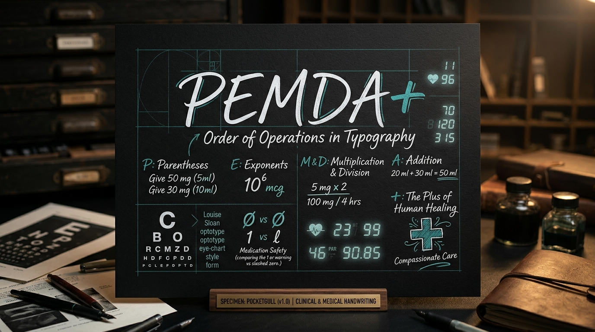
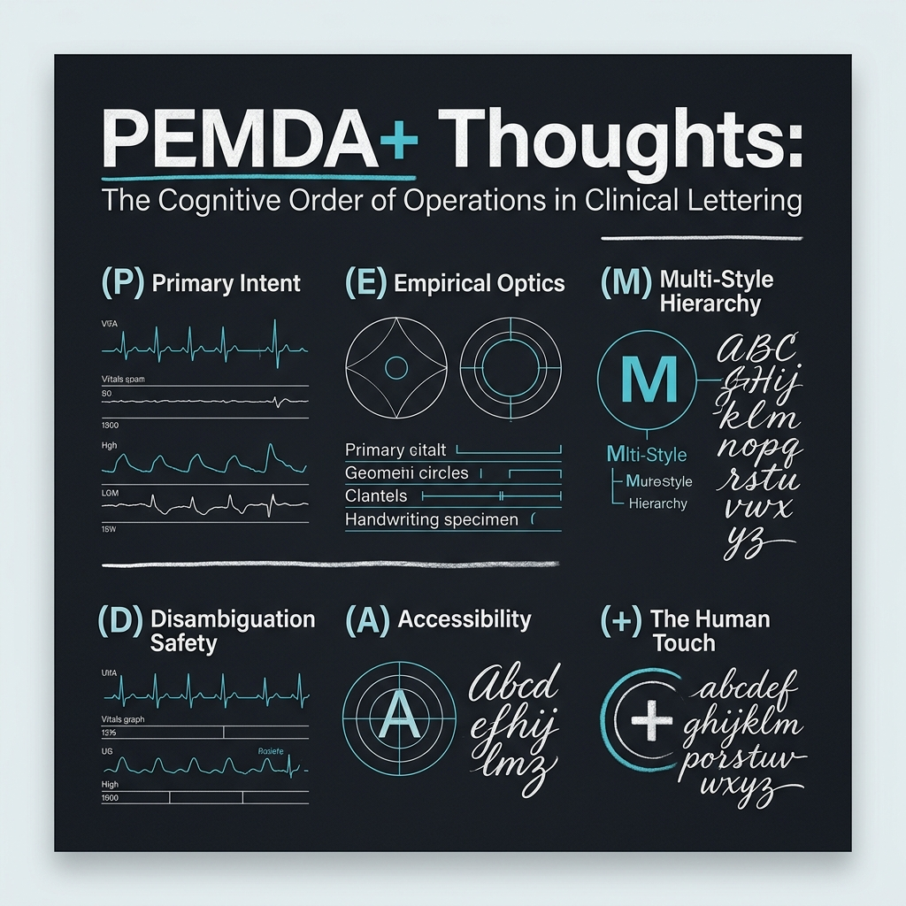

# PEMDA+ Thoughts: The Cognitive Order of Operations in Clinical Typography

```
    (P) → [E] → {M × D} → (A +)
    Principles → Empirical Optics → Hierarchy & Disambiguation → Universal Accessibility + Healing
```

---

## Overview

In elementary arithmetic, the **PEMDAS** order of operations ensures that mathematical statements are interpreted unambiguously:
$$\text{Parentheses} \rightarrow \text{Exponents} \rightarrow \text{Multiplication \& Division} \rightarrow \text{Addition \& Subtraction}$$

In safety-critical medical communication, where a single ambiguous digit or confusable character can cause a 10-fold medication dosing error, **PEMDA+ Thoughts** provides an analogous, inviolable cognitive framework. Designed by Phil Gear during the drafting of the **PocketGull** typeface superfamily, PEMDA+ defines the structural sequence through which organic human handwriting is elevated into an optotypically precise clinical instrument.

---

## The 6 Pillars of PEMDA+

### 1. (P) Primary Intent & Physical Inking
- **The Human Touch**: Typography begins with the physical gesture. PocketGull’s letterforms originate from broad-edged and fine felt-tip markers inked by hand onto heavyweight cotton cardstock.
- **Organic Micro-Modulation**: Unlike sterile, synthetic geometric fonts, PocketGull preserves the natural entry angles, baseline breath, and human warmth that reassure anxious patients and comfort stressed caregivers.
- **Parenthetical Containment**: Establishing the foundational core baseline before mathematical expansion.

### 2. [E] Empirical Optics & Exponential Clarity
- **Louise Sloan 5:1 Grid**: Every capital letter and numeral conforms to the empirical optotypic standards established by Dr. Louise Sloan in 1959 for Snellen 20/20 visual acuity (5-arcminute subtended angle with 1-arcminute stroke thickness at 50–70 cm reading distances).
- **LogMAR 0.0 Precision**: The glyph outlines maintain maximum contrast and stroke definition across low-resolution hospital displays, monochrome thermal label printers, and clinical COW workstations.
- **Herman Bouma Lateral Spacing ($0.12\text{em}$)**: Critical numerals and prescription lines are engineered with Bouma anti-crowding spacing, preventing peripheral visual interference in geriatric and low-vision readers.

### 3. {M} Multi-Style Hierarchy
- **Coordinated 4-Master Superfamily**:
  1. **PocketGull Bold (700)**: Strong, decisive headline and patient warning markers.
  2. **PocketGull Fineliner (400)**: Clean, high-throughput body text and clinical progress notes.
  3. **PocketGull Chiseltip (900)**: Dynamic calligraphic display, trauma triage headers, and brand imprint.
  4. **PocketGull Mono (400, 600 UPM pitch)**: Strict fixed-pitch alignment for ICU telemetry, lab reports, tabular blood pressure vitals, and HL7 FHIR console outputs.

### 4. {D} Disambiguation Safety & Division
- **Zero Confusion Invariant**: Direct compliance with the Institute for Safe Medication Practices (ISMP) and FDA CDRH guidelines for error-prone medical terminology:
  - **`cv08` (Slashed Zero $\emptyset$)**: Eliminates dangerous confusion between numeral `0` and capital letter `O`.
  - **`cv05` (Curved Lowercase `l`)**: Prevents fatal confusion between lowercase `l` and numeral `1` in drug dosage units (e.g., `100 mg` vs `l00 mg`).
  - **`ss02` (Serifed Capital `I`)**: Disambiguates capital `I` from lowercase `l` in intravenous acronyms (`IV`, `IM`).
  - **Hooked Numeral `1`**: Clear serifed crown and foot bar distinct from vertical pipes (`|`).

### 5. (A) Universal Accessibility & Addition
- **Complete 256-Glyph Braille Block (`U+2800`–`U+28FF`)**: PocketGull includes the entire Unicode 8-dot and 6-dot Braille standard, allowing direct dual-modality tactile and sighted medical labeling.
- **WCAG 2.1 AAA Contrast**: Designed with minimum 7:1 optical contrast against dark obsidian surfaces (`#09090b`), optimizing readability in dimly lit hospital night shifts.
- **Tabular Figures (`tnum`)**: Tabular numbers ensure vital signs, decimal points, and drug quantities align vertically across clinical flowsheets without horizontal jitter.

### 6. (+) The Plus: The Quiet Workshop Voice & Human Healing
- **The Healing Plus**: Medical care is more than sterile telemetry; it is a sacred human connection. PocketGull speaks with the "Quiet Workshop Voice"—warm, capable, unhurried, and reassuring.
- **Bio-Rhythmic Pacing**: Optical balance calibrated to soothe the parasympathetic nervous system ($0.1\text{ Hz}$ bio-resonance), reducing cognitive load and anxiety for patients reviewing their living health trajectories.

---

## Promotional Assets





---

*Copyright 2026 The PocketGull Project Authors (https://github.com/pocketgull-app/pocketgull-typeface)*
